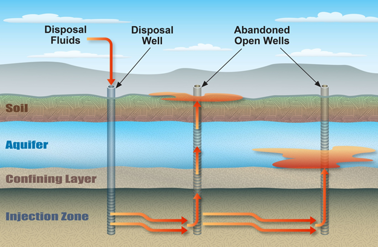

# class_II_UIC_PRA

This repository provides the [GoldSim](https://www.goldsim.com/Web/Home/), dynamic probabilistic risk assessment (PRA) models used in the manuscript entitled "Enhanced Water Resources Risk from Collocation of Disposal Wells and Legacy Oil and Gas Exploration and Production Regions in Texas".   
   

## About the Project

This project is a scientific study of the impacts to water resources from Class II, Underground Injection Control (UIC) disposal wells collocated with oil and gas exploration and production regions. PRA methodologies are employed in the study to examine potential impacts. The PRAs are implemented in [GoldSim](https://www.goldsim.com/Web/Home/) software. GitHub is used to provide open access to these models. Project findings:

1. Class II disposal well systems provide elevated risk to water resources relative to Class IH injection well systems because of relaxation of permitting requirements related to pressure monitoring, number of confining layers, and waste migration monitoring
2. Class II disposal well systems collocated with legacy and active oil and gas activities generated elevated risk to water resources relative to generic Class II disposal wells, which are not collocated, because oil and gas activities provide potential waste migration pathways as illustrated below.

   
**Enhanced likelihood for waste migration pathways produced by unknown wells and by increased likelihood for a plug failure when there are many abandoned wells that pierce the waste sequestration zone** Unknown wells are forgotten wells that were never plugged when abandoned. Legacy oil and gas activities increase the likelihood of unknown wells because boreholes were not historically tracked in databases due to historical technology limitations and limited permitting requirements, historically. Wells that were abandoned (i.e., plugged) decades ago have an enhanced probability of plug construction and installation with what are considered sub-standard methods and materials in comparison to modern practice. "Open Wells and Plug Failure" by [Southwest Research Institute](https://www.swri.org/industries/earth-science) can be reused under the [CC BY 4.0](https://creativecommons.org/licenses/by/4.0/legalcode) license.   
   

## What is in the Project?

Three PRAs, implemented in [GoldSim](https://www.goldsim.com/Web/Home/) software, are in the project. A standard GoldSim model file (.gsm), which requires a license to use, and a [GoldSim Player](https://www.goldsim.com/Web/Products/GoldSimPlayer/) file (.gsp) are provided for each PRA. [GoldSim Player](https://www.goldsim.com/Web/Products/GoldSimPlayer/) allows anyone to execute and interrogate a [GoldSim](https://www.goldsim.com/Web/Home/) model without a license. The GoldSim model files are available in [goldsim_models](https://github.com/nmartin198/class_II_UIC_PRA/tree/main/goldsim_models) subdirectory.  

1. **Generic Class IH** disposal well system PRA
    - *PRA_Class1_Rish.(gsm | gsp)*   
 

2. **Generic Class II** disposal well system PRA for Texas incorporating modifications for addressing water resources risks from variations in permitting requirements between Class IH injection and Class II disposal well systems. Permitting requirements for pressure monitoring, number of confining layers, and waste migration monitoring are relatively relaxed for Class II disposal wells.
    - *PRA_Class-II_Texas.(gsm | gsp)*   
 

3. **Generic Class II collocated with legacy and active oil and gas activities** disposal well system PRA for Dimmit County, Texas. Dimmit County is used to derive likelihoods for distance to nearest oil and gas well, oil and gas well depth, and plug age for abandoned wells. Otherwise, this PRA is generic for Class II disposal collocated with oil and gas exploration and production.
    - *PRA_Class-II_TxCollocOG.(gsm | gsp)*   
 

## Authors

* Nick Martin (nmartin@swri.org)
* Kindra Nicholaides (ardnik@gmail.com)
* Paul Southard (paulsouthard1@gmail.com)
   
   

## License

This project is licensed under the GNU General Public License v.3.0 - see the [LICENSE](LICENSE) file for details.
   
   
   

## Acknowledgments

This work was funded by [Southwest Research Institute](https://www.swri.org/industries/earth-science) internal research and 
development grant 15-R8979.

